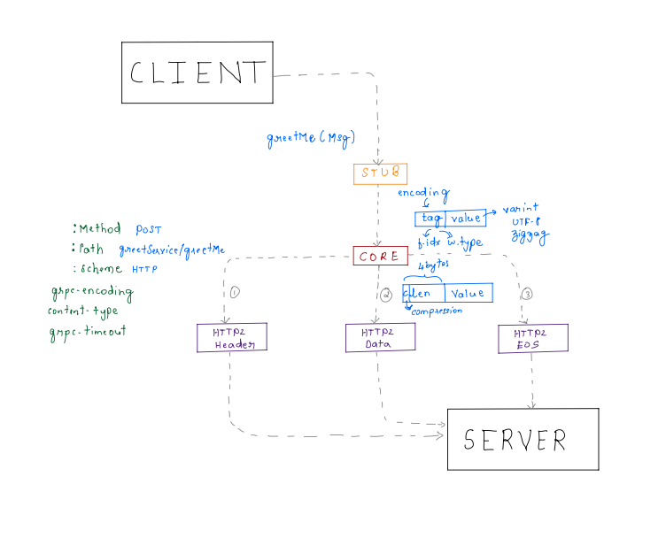
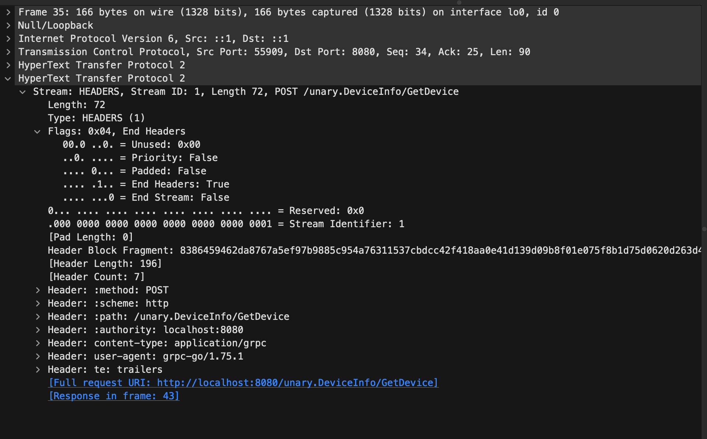
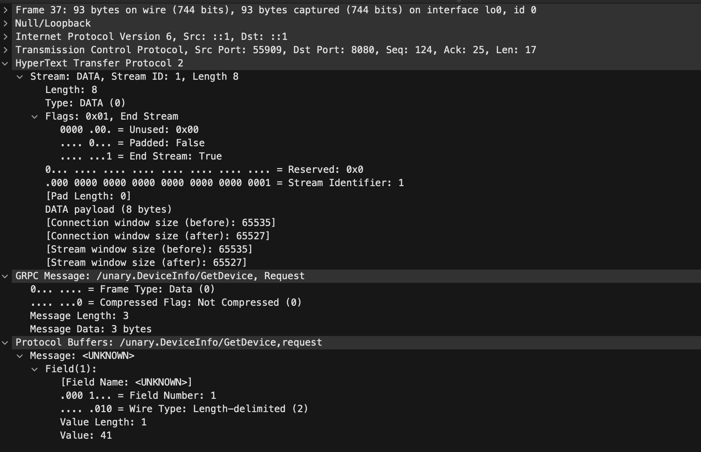
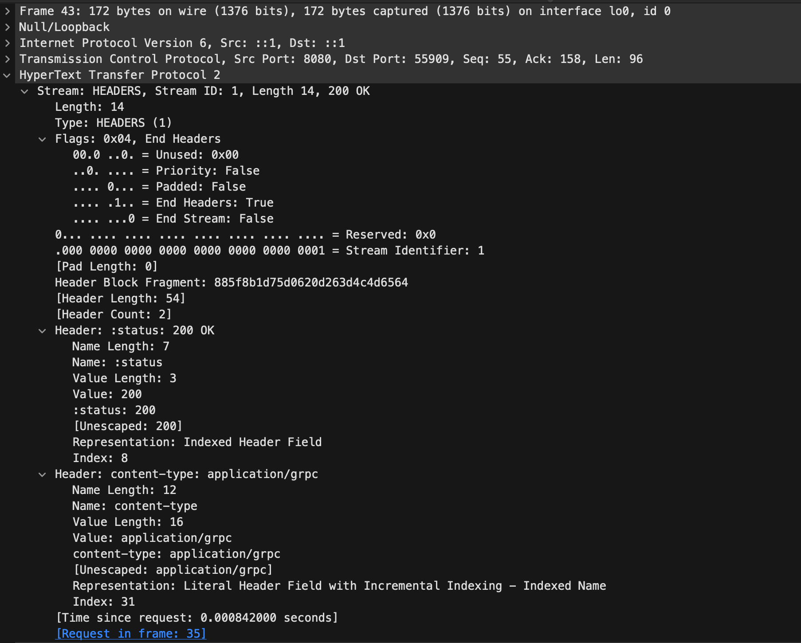
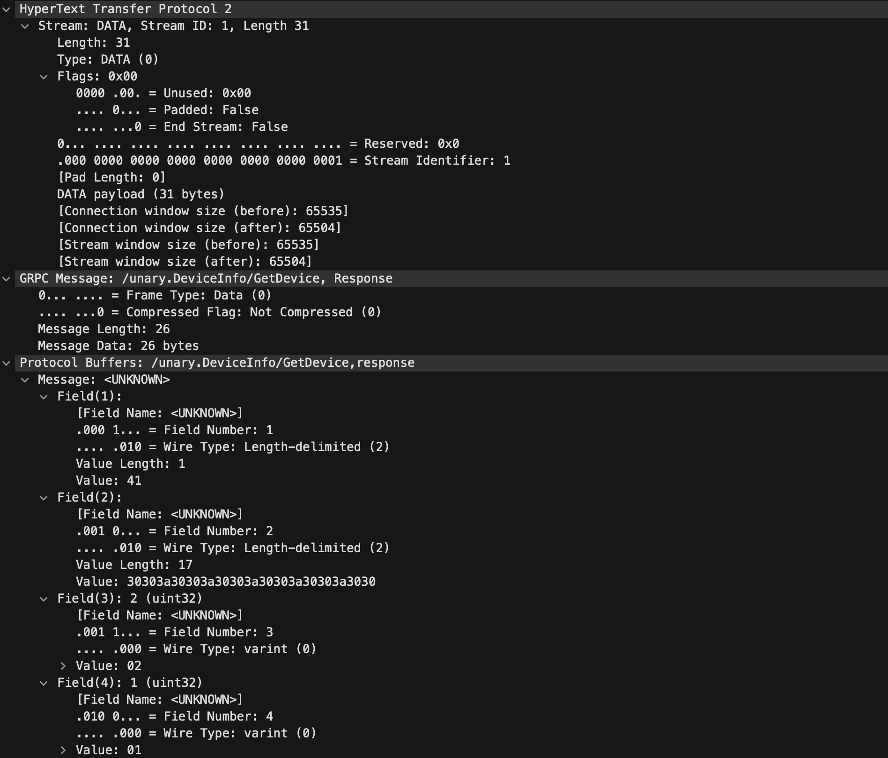
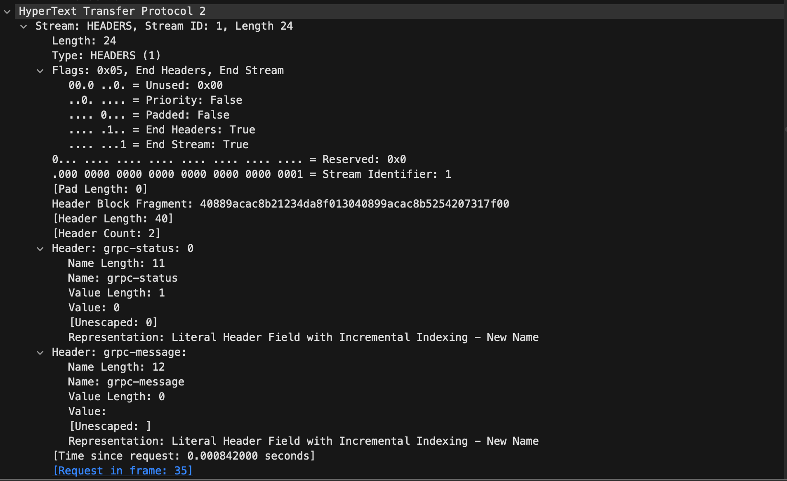

# gRPC under the hood.

gRPC is a high performance, open-source universal RPC framework that uses HTTP/2 for transport, 
Protocol Buffers as the interface description language, and provides features such as authentication, 
load balancing, and more.

### Unary RPC
Unary RPC is the simplest type of RPC where the client sends a single request to the server and
receives a single response back. This is similar to a traditional function call in programming.

In this example, we create a simple gRPC service that implements a unary RPC method. The service will have a method
called `GetDevice` that takes a `DeviceRequest` message and returns a `DeviceResponse` message.

### Sample call flow

### Wireshark Captures

# Step 1: Client sends a HTTP/2 Header 

# Step 2: Client sends a HTTP/2 Data Frame with END_STREAM flag set to true indicate the end of the request.

# Step 3: Server sends a HTTP/2 Header Frame with END_STREAM flag set to false.

# Step 4: Server sends a HTTP/2 Data Frame. 

# Step 5: Server sends a HTTP/2 Trailers Frame with END_STREAM flag set to true indicate the end of the response.

